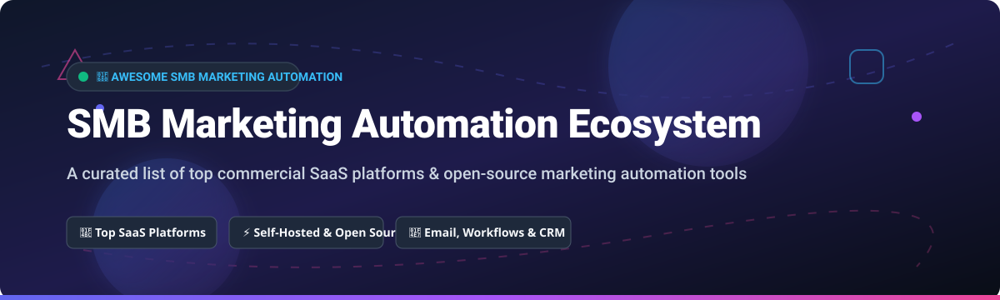

# 🚀 Awesome SMB Marketing Automation Ecosystem

  
  
  
  
  

## 📌 Top SMB Marketing Automation Ecosystem

**A Curated List of Commercial SaaS Products & Open-Source GitHub Projects for Small & Medium Businesses (SMBs)**

*Focused on Email Campaigns, Lead Scoring, Visual Workflows, Omnichannel Messaging & Self-Hosted Marketing Automation Solutions.*

**Last updated: October 2026**

---

### 💡 Overview & SEO Summary

This repository tracks notable **commercial SMB marketing automation platforms**, **email marketing software**, and **open-source marketing automation tools** that empower small and medium enterprises (SMBs) to automate customer journeys, run newsletter campaigns, capture and score leads, and build multi-step email workflows without enterprise pricing models.

Whether you need a full-featured cloud SaaS suite like HubSpot or ActiveCampaign, an affordable self-hosted email newsletter engine like Listmonk, or an enterprise-grade open-source automation framework like Mautic, this awesome-list provides complete transparency into pricing, free tier limits, company valuation/revenue scale, and GitHub star counts.

---

## 📑 Table of Contents

- [📊 Market Overview & Industry Dynamics](#-market-overview--industry-dynamics)
- [💼 Commercial SaaS Platforms](#-commercial-saas-platforms)
- [⚡ Open-Source GitHub Projects](#-open-source-github-projects)
  - [Full Marketing Automation Frameworks](#full-marketing-automation-frameworks)
  - [High-Performance Newsletter & Campaign Managers](#high-performance-newsletter--campaign-managers)
  - [Transactional Email & Developer APIs](#transactional-email--developer-apis)
  - [Workflow & Analytics Integrations](#workflow--analytics-integrations)
- [🤝 How to Contribute](#-how-to-contribute)
- [☕ Support](#-support)
- [📈 Star History](#-star-history)
- [⚠️ Disclaimer](#%EF%B8%8F-disclaimer)

---

## 📊 Market Overview & Industry Dynamics

> 📈 **Market Size & Structure**: The global SMB Marketing Automation market is estimated at **$6.2 Billion in 2026** and is projected to reach **$13.5 Billion by 2032** growing at a CAGR of 13.8%. The SMB marketing sector is **highly fragmented**, characterized by low switching costs, diverse customer verticals (e.g., e-commerce vs. B2B vs. local services), and fierce competition between incumbent SaaS giants (HubSpot, Intuit Mailchimp) and a growing ecosystem of lean SaaS startups and self-hosted open-source alternatives.

---

## 💼 Commercial SaaS Platforms

Below is a comparative breakdown of top commercial SMB marketing automation and email marketing tools, ordered by estimated annual revenue and market valuation (descending).

| Product | Description & Core Use Case | Starting Paid Plan | Free Tier / Trial Limit | Est. Revenue / Valuation |
| :--- | :--- | :--- | :--- | :--- |
| **[Mailchimp](https://mailchimp.com/)** | **Category Leader** — Email marketing, customer journeys, CRM, and drag-and-drop landing page builder. | $13.00 / month | Free forever (up to 500 contacts, 1,000 email sends/mo) | ~$1.2 Billion Rev / $12B Valuation (Acquired by Intuit) |
| **[HubSpot Starter](https://www.hubspot.com/)** | **All-in-one Growth Suite** — Form capture, contact management, email marketing, and light CRM integration. | $15.00 / month | Free forever (up to 2,000 email sends/mo & free CRM) | ~$2.1 Billion Annual Revenue (Public: HUBS) |
| **[Constant Contact](https://www.constantcontact.com/)** | **Small Business Standard** — Email templates, event management, social posting, and SMS marketing. | $12.00 / month | 60-day Free Trial (Up to 100 contacts) | ~$350 Million Annual Revenue |
| **[ActiveCampaign](https://www.activecampaign.com/)** | **Advanced Automation Leader** — Powerful multi-step branching workflows, lead scoring, CRM, and 850+ pre-built recipes. | $29.00 / month | 14-day Free Trial (Full feature access, no credit card) | ~$250 Million ARR / $1.5B Valuation |
| **[Brevo](https://www.brevo.com/)** *(formerly Sendinblue)* | **Omnichannel Suite** — Email campaigns, transactional SMS, WhatsApp marketing, live chat, and CRM. | $9.00 / month | Free forever (300 emails/day limit, unlimited contacts) | ~$110 Million Annual Revenue |
| **[GetResponse](https://www.getresponse.com/)** | **Complete Marketing Funnel** — Autoresponders, landing pages, webinars, AI email generator, and paid ads. | $19.00 / month | 30-day Free Trial (Up to 2,500 email sends, no credit card) | ~$85 Million Annual Revenue |
| **[AWeber](https://www.aweber.com/)** | **Solopreneur & Creator Favorite** — Autoresponders, newsletter publishing, RSS-to-email, and push notifications. | $12.50 / month | Free forever (up to 500 subscribers, 3,000 email sends/mo) | ~$50 Million Annual Revenue |
| **[MailerLite](https://www.mailerlite.com/)** | **Modern & Clean UX** — Intuitive drag-and-drop newsletter builder, landing pages, website builder, and digital product sales. | $9.00 / month | Free forever (up to 1,000 subscribers, 12,000 email sends/mo) | ~$25 Million Annual Revenue |
| **[Drip](https://www.drip.com/)** | **E-commerce Specialist** — Deep Shopify/WooCommerce integrations, customer behavioral tracking, and dynamic product recommendations. | $39.00 / month | 14-day Free Trial (Full access up to 2,500 contacts) | ~$20 Million Annual Revenue |
| **[Moosend](https://moosend.com/)** | **Budget Automation** — Affordable email marketing, visual workflow designer, subscription forms, and transactional emails. | $9.00 / month | 30-day Free Trial (Unlimited email sends to trial list) | ~$10 Million Annual Revenue |

---

## ⚡ Open-Source GitHub Projects

Self-hosted marketing automation platforms offer complete data sovereignty, zero per-subscriber licensing costs, and complete customization. Below projects are ordered by GitHub Star Count (descending).

### Full Marketing Automation Frameworks

- **[Mautic](https://github.com/mautic/mautic)** 
  - **The world's premier open-source marketing automation suite** (GPL-3.0 licensed).
  - Features visual multi-channel campaign builders, landing page and form builders, lead scoring, segmentation, contact tracking, and extensive REST APIs.
  - Used by over 40,000+ organizations globally. Requires cron worker setup for background queue execution.

- **[Notifuse](https://github.com/Notifuse/notifuse)** 
  - **Modern self-hosted newsletter & email automation engine** (AGPL-3.0 licensed).
  - Built-in MJML visual email editor, branching automation flows, multi-provider SMTP routing (SES, Mailgun, Postmark), and cookieless web analytics attribution.

---

### High-Performance Newsletter & Campaign Managers

- **[Listmonk](https://github.com/knadh/listmonk)** 
  - **Ultra-fast, single binary newsletter and mailing list manager** (AGPL-3.0 licensed).
  - Written in Go with PostgreSQL backend. Handles millions of emails with minimal memory footprint, dynamic templating, fast subscriber tagging, and analytics.

- **[Keila](https://github.com/pentacent/keila)** 
  - **GDPR-compliant open-source newsletter application** (AGPL-3.0 licensed).
  - Features modern block-based and MJML visual editors, customizable form widgets, subscriber double opt-in, and per-sender SMTP configurations.

- **[Senddock](https://github.com/arkhe-systems/senddock)** 
  - **API-first open-source email marketing platform** built with Go and Vue.
  - Offers GrapesJS visual template editing, automated bounce handling, click/open tracking, RFC 8058 one-click unsubscribe, and transactional send APIs.

- **[phpList](https://github.com/phpList/phplist3)** 
  - **Veteran open-source newsletter software** (AGPL-3.0 licensed).
  - Includes subscriber management, list segmentation, bounce processing, and web analytics integration.

- **[Mailtrain](https://github.com/Mailtrain-org/mailtrain)** 
  - **Self-hosted newsletter management app** built on Node.js and MySQL.
  - Supports large subscriber lists, custom field management, GPG email signing, and automation triggers.

---

### Transactional Email & Developer APIs

- **[Reloop](https://github.com/reloop-labs/reloop)** 
  - **Open-source Resend alternative for transactional & campaign email** (Apache-2.0 licensed).
  - Provides inbound email parsing, visual template editor, real-time delivery webhooks, contact list segmentation, and single-command VPS deployment.

---

### Workflow & Analytics Integrations

- **[n8n](https://github.com/n8n-io/n8n)** 
  - **Fair-code workflow automation platform**.
  - Connects SMB marketing tools with 400+ native nodes for lead capture, webhooks, CRM syncing, and custom email sequences.

- **[PostHog](https://github.com/PostHog/posthog)** 
  - **Open-source product analytics & feature flags platform** (MIT licensed).
  - Includes session recording, user path funnels, and A/B testing for marketing experiment optimization.

---

## 🤝 How to Contribute

Contributions are welcome! Please follow these simple guidelines:

1. Fork this repository.
2. Create a feature branch (`git checkout -b feature/new-marketing-tool`).
3. Add or update entries maintaining alphabetical or star-based order.
4. Ensure descriptions remain objective, concise, and factual.
5. Submit a Pull Request.

Please check out our list of awesome repositories at [Awesome-Awesome-Awesome](https://github.com/ishandutta2007/Awesome-Awesome-Awesome).

---

## ☕ Support

If you find this repository helpful for evaluating SMB marketing automation software or deploying self-hosted email infrastructure, please consider starring ⭐ the repository, sharing it with fellow marketers and developers, or sponsoring the project!

---

## 📈 Star History

---

## ⚠️ Disclaimer

- This curated list is maintained for informational and educational purposes only.
- Marketing automation systems handle sensitive personally identifiable information (PII) and compliance domains (GDPR, CAN-SPAM, CCPA, CASL). Self-hosted platforms require diligent server security, access management, and IP reputation warming.
- Cron configuration is critical for self-hosted tools like Mautic — failure to configure cron tasks will prevent scheduled email delivery and campaign triggers.
